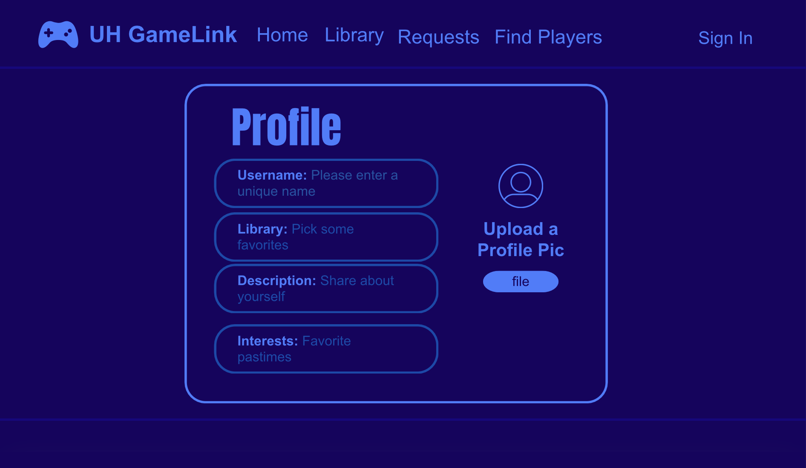
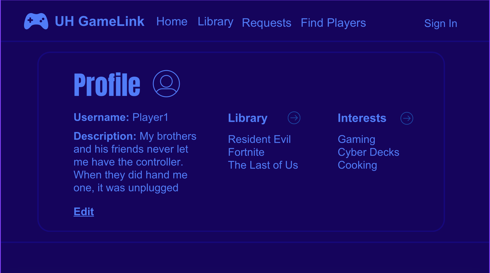
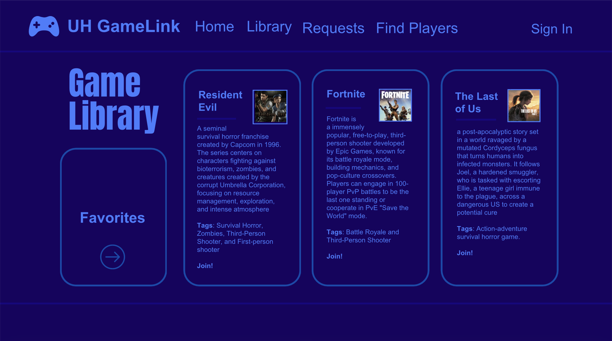
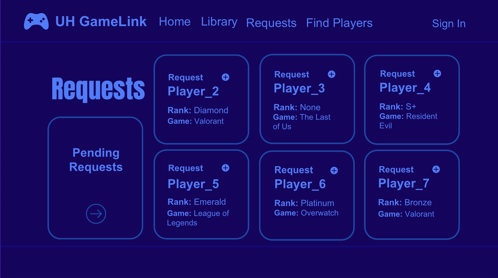
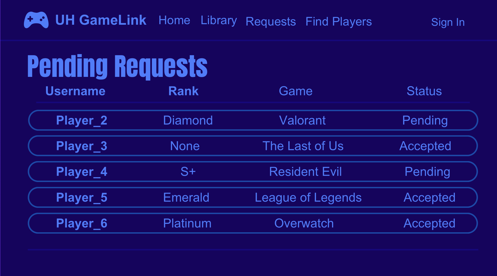

  

# UH GameLink

UH GameLink is a web application designed to help University of Hawaiʻi students connect with other students through video games. Many students play games casually or competitively, but it can be difficult to find other UH students with similar interests, schedules, or favorite games. This project aims to make it easier for students to meet new people, discover gaming communities, and build connections through shared games.

## Table of contents

* [Project Overview](#project-overview)
* [Project Goals](#project-goals)
* [Planned System Features](#planned-system-features)
* [Current Project Status](#current-project-status)
* [Initial Mockup Pages](#initial-mockup-pages)
* [Team Members](#team-members)
* [Team Contract](#team-contract)
* [Github Organization](#github-organization)
* [Deployment](#deployment)
* [M1](https://github.com/orgs/uh-gamelink/projects/2)
* [M2](https://github.com/orgs/uh-gamelink/projects/5)

## Project Overview

UH GameLink is a web application designed to help University of Hawaiʻi students connect with other students through video games. Many students play games casually or competitively, but it can be difficult to find other UH students with similar interests, schedules, or favorite games. This project aims to make it easier for students to meet new people, discover gaming communities, and build connections through shared games.

## Project Goals

The main goal of UH GameLink is to create a centralized place where students can:

- Build and customize a personal game library
- Share gaming preferences and interests
- Find other UH students who play the same games
- Discover gaming-related Discord servers, groups, and events
- Connect with others for casual play, teamwork, or community involvement

## Planned System Features

As the project develops, the system is expected to provide:

- User accounts and profiles
- A personalized home page
- A video game library page
- A community page for gaming-related groups and resources
- A game request page for students searching for people to play with
- A player discovery page to find other users with similar games and preferences
- Administrative moderation and support features

These features are intended to help users not only organize their own gaming interests, but also actively connect with other members of the UH community.

## Current Project Status

This project is still in the early stages. At the moment, we have completed a brief project proposal and created a few rough mockup images to guide our design process. As development continues, this page will be updated to reflect the latest version of the project, including implemented features, design changes, and screenshots of the working system.

## Initial Mockup Pages

Below are the rough mockups that will serve as the basis for our final project design.

### User Home Page & Edit Page

* Shows User profile picture, profile description, and username, which can be edited
* Lists the User's games they have in their library.
* Lists their Interests (genres of video games, hobbies, etc.)

### Game Library Page

* Lists a variety of different games
* Each game shows an image of it, the name, a short description, and tags of what genre of game it is
* The User can add a game to their library, which will show on their homepage.

### Game Requests Page

* The two functions of this page are to view other players requests and create your own request
* This page will allow the user to send out a public request that other players can see in their own Requests page
* The create request portion of this page will just have several fields they can fill out (game, rank, description of request)
* This page will also have a link to the Pending Requests Page

### Pending Request Page

* This page will allow the user view the status of the requests they have made or accepted
* Each request will show the other users' information, such as rank, game, and whether it has been accepted yet
* Requests can be removed or edited. 

## Team Members

- [Tuan Do](https://mtuando.github.io/)
- [John Gabriel Martinez](https://johngabrielmartinez.github.io/)
- [Ella Self](https://ellaself.github.io/)
- [Mason Vuong](https://mvuong808.github.io/)
- [Peyton Young](https://peytony9.github.io/)

## Team Contract

[View our Team Contract](https://docs.google.com/document/d/e/2PACX-1vRwtZI0GAWnwQ4oEau8QPwQtFm7aZ480nLDKV6xLEkga-hFvJbkGLqEwaJkZ7Y-P04amXjYO-S2kBL5/pub)

## Github Organization
[UH GameLink](https://github.com/uh-gamelink)

## Deployment
Coming Soon

## M1 
[M1](https://github.com/orgs/uh-gamelink/projects/2)

## M2
[M2](https://github.com/orgs/uh-gamelink/projects/5)
